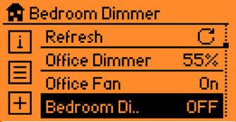
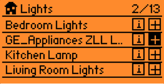
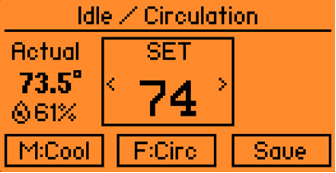

# FlipperHA

A native Flipper Zero app for controlling Home Assistant. It talks to a small local Python bridge, so your Home Assistant token stays on your computer and the Flipper only stores a bridge URL plus a shared key.

<p>
  
</p>
<p>
  
  
</p>

## What It Does

- Adds Home Assistant switches, lights, dimmable lights, and routines to a Flipper Controller screen.
- Shows current states after refresh, including dimmer percentages.
- Queues commands so you can tap through a few actions without waiting on each request.
- Lets you reorder and delete Controller rows on-device.
- Lets you choose a Home Assistant `climate.*` entity for the Thermostat screen.
- Keeps the Home Assistant bearer token off the Flipper.

## What You Need

- A Flipper Zero.
- A Flipper Zero WiFi Developer Board running FlipperHTTP.
- A Home Assistant instance and access token.
- A computer that can reach Home Assistant and run the Python bridge.
- Python 3.10 or newer for the bridge.
- `ufbt` if you want to build the Flipper app yourself.

## How It Works

```text
Flipper app -> WiFi Dev Board / FlipperHTTP -> local bridge -> Home Assistant
```

The bridge exposes compact `/v1/...` endpoints for the Flipper. Home Assistant sees normal service calls, and the bridge writes a local command log for debugging.

## Quick Start

1. Copy `.env.example` to `.env` and add your Home Assistant URL, token, and bridge key.
2. Start the bridge:

```powershell
python bridge\ha_state_bridge.py --env .env --host 127.0.0.1 --port 8765
```

3. Verify the bridge from the same computer:

```powershell
$key = (Select-String .env -Pattern '^FLIPPERHA_BRIDGE_KEY=(.+)$').Matches.Groups[1].Value
Invoke-WebRequest -UseBasicParsing "http://127.0.0.1:8765/v1/setup/check?k=$key"
```

4. Build and install the Flipper app:

```powershell
cd flipper_app
py -m ufbt build
py -m ufbt launch
```

5. Copy `examples\bridge.example.cfg` to the Flipper SD card at:

```text
/ext/apps_data/flipperha/bridge.cfg
```

6. Edit `bridge.cfg` so `url=` is the bridge URL reachable by the WiFi Developer Board and `key=` matches `FLIPPERHA_BRIDGE_KEY`.

7. Open FlipperHA on the Flipper. Use Controller -> Add to browse entities, and open Thermostat to choose a `climate.*` entity.

## First-Run Checks

- Controller -> Info should show `Cfg:file` once `bridge.cfg` is loaded.
- `/healthz` should return `ok` from the bridge computer.
- `/v1/setup/check?k=...` should return `ok` before you test from the Flipper.
- If the app shows `no board`, confirm the WiFi Developer Board is attached and FlipperHTTP is running.
- If the app shows `get timeout`, the board probably cannot reach the configured bridge URL.

## Documentation

- [Bridge setup](docs/bridge-setup.md)
- [Flipper SD-card app config](docs/app-config.md)
- [Troubleshooting](docs/troubleshooting.md)
- [WiFi Developer Board notes](docs/wifi-dev-board.md)
- [Release build notes](docs/release-build.md)
- [Migration notes](docs/migration.md)
- [Host tooling and logs](docs/flipper-host-tooling.md)

## Security

Do not put your Home Assistant bearer token on the Flipper. Keep it in `.env` on the bridge computer. Treat `FLIPPERHA_BRIDGE_KEY` like a password, especially if you expose the bridge through a tunnel.

For local HTTP bridge URLs, keep the bridge on your trusted LAN. For remote or HTTPS testing, prefer an access-controlled tunnel.

## Status

The default Controller starts blank, and users add their own Home Assistant entities on-device.

## License

MIT. See [LICENSE](LICENSE).
